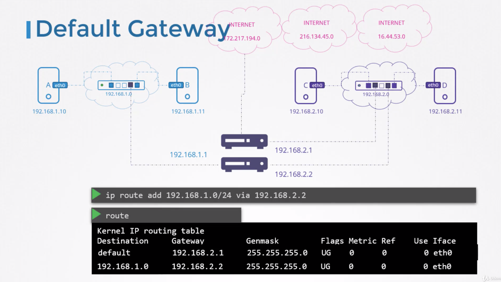

# linux networking

# How two computers talk to each other?

# Switch to connect two computers

# How two switch network talk to each others?

# Router to connect two switches

# Gateway to configure switch to router

# How to connect to internet?

# Default Gateway?

# Setup linux host as a router

- Add gateway to routing table entry

- Allow host B to forward network from `eth0` to `eth1`

- To persist ipforward 

# Take away

